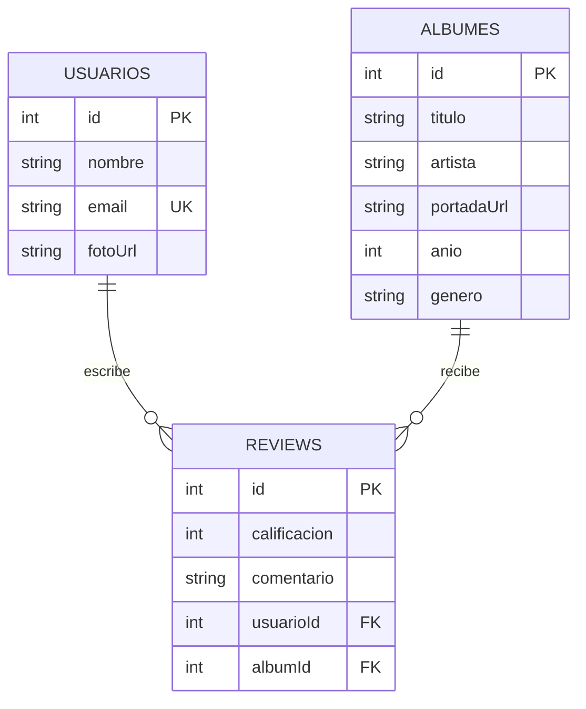
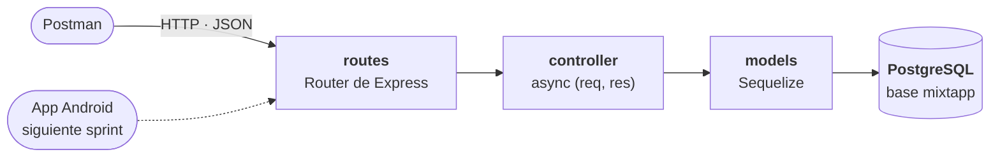

# Mixtapp Backend

**La API REST de Mixtapp: usuarios, álbumes y las reseñas que los unen.**

Mixtapp Backend es la API de [Mixtapp](https://github.com/AndresContreras1/Mixtapp), la app Android donde
abres un álbum, le pones una calificación y escribes tu reseña. Expone los usuarios y los álbumes en modo
lectura y un CRUD completo de reseñas, cada una ligada a un usuario y a un álbum. Está hecha con Node.js,
Express y Sequelize sobre PostgreSQL, y es la entrega del sprint 8 de Computación Móvil.


> [!NOTE]
> No hay autenticación: el enunciado del sprint la deja por fuera. Cada arranque recrea las tablas con
> `sync({ force: true })` y vuelve a cargar los datos iniciales, así que los ids empiezan siempre en 1 y lo
> que se crea durante una sesión se pierde al reiniciar el servidor.

## Contenido

[Qué hace](#qué-hace) · [Funcionalidades](#funcionalidades) · [Arquitectura](#arquitectura) ·
[Cómo ejecutarlo](#cómo-ejecutarlo) · [Endpoints](#endpoints) · [Pruebas con Postman](#pruebas-con-postman) ·
[Estructura](#estructura) · [Siguiente paso](#siguiente-paso) · [Equipo](#equipo)

## Qué hace



Un usuario escribe muchas reseñas y un álbum recibe muchas; cada reseña pertenece a un solo usuario y a un
solo álbum. Antes de guardar una reseña, la API comprueba que el usuario y el álbum existan, y las dos llaves
foráneas quedan también en PostgreSQL, así que no puede quedar una reseña apuntando a algo que no existe.

## Funcionalidades

| Área | Qué tiene |
|---|---|
| **Usuarios** | Consulta de un usuario por id, y de sus reseñas con el álbum de cada una. |
| **Álbumes** | Todos los álbumes, el detalle de uno por id, y sus reseñas con el usuario que escribió cada una. |
| **Reseñas** | Crear con id de usuario, id de álbum, calificación y comentario; modificar y eliminar por id. |
| **Datos iniciales** | 5 usuarios, los 8 álbumes de la app con sus portadas y 5 reseñas, cargados al arrancar con `count()` y `bulkCreate`. Los ids de los álbumes coinciden con los de la app. |
| **Errores** | `404` en JSON cuando el usuario, el álbum o la reseña no existen, y `500` en JSON cuando una consulta falla. |

## Arquitectura



Cada petición entra por un router, que la pasa a una función del controlador; el controlador consulta con los
modelos de Sequelize y responde JSON. Las relaciones se declaran en `models/relations.js`, y el arranque sigue
siempre el mismo orden: conectar, crear las tablas, crear las relaciones y cargar los datos.

| Capa | Tecnología |
|---|---|
| Servidor | Node.js · Express 5 |
| Datos | PostgreSQL 17 · Sequelize 6 con `pg` y `pg-hstore` |
| Desarrollo | nodemon |
| Herramientas | DBeaver para ver la base · Postman para las peticiones |

## Cómo ejecutarlo

Necesitas Node.js y PostgreSQL escuchando en el puerto 5432.

1. Crea la base `mixtapp`. En DBeaver: conexión a PostgreSQL, *Databases → Crear nueva base de datos*.
2. Clona el repositorio e instala las dependencias:

```bash
git clone https://github.com/AndresContreras1/mixtapp-backend.git
cd mixtapp-backend
npm install
```

3. Revisa la conexión en `src/database/database.js`: base, usuario, contraseña y puerto de tu PostgreSQL.
4. Arranca el servidor:

```bash
npm run dev
```

En la consola tienen que salir estas líneas, y la API queda en `http://localhost:3000`:

```text
Conexión a la base de datos establecida
Initial usuarios loaded
Initial albumes loaded
Initial reviews loaded
Servidor escuchando en el puerto 3000
```

## Endpoints

| Método | Ruta | Qué hace | Respuestas |
|---|---|---|---|
| `GET` | `/usuarios/:id` | Un usuario por id | `200` · `404` |
| `GET` | `/usuarios/:id/reviews` | Las reseñas de un usuario, con el álbum de cada una | `200` · `404` |
| `GET` | `/albumes` | Todos los álbumes | `200` |
| `GET` | `/albumes/:id` | El detalle de un álbum | `200` · `404` |
| `GET` | `/albumes/:id/reviews` | Las reseñas de un álbum, con el usuario de cada una | `200` · `404` |
| `POST` | `/reviews` | Crea una reseña | `200` · `404` |
| `PUT` | `/reviews/:id` | Modifica una reseña | `200` · `404` |
| `DELETE` | `/reviews/:id` | Elimina una reseña | `204` · `404` |

Crear una reseña lleva el id del usuario, el id del álbum y la reseña en el body:

```json
{
  "usuarioId": 4,
  "albumId": 6,
  "calificacion": 5,
  "comentario": "Toxicity sigue sonando igual de potente."
}
```

Si el usuario o el álbum no existen, responde `404` con `{ "error": "Usuario no encontrado" }` o
`{ "error": "Álbum no encontrado" }`. Las reseñas de un álbum traen anidado al usuario que las escribió:

```json
[
  {
    "id": 6,
    "calificacion": 5,
    "comentario": "Toxicity sigue sonando igual de potente.",
    "usuarioId": 4,
    "albumId": 6,
    "createdAt": "2026-10-02T15:48:09.103Z",
    "updatedAt": "2026-10-02T15:48:09.103Z",
    "usuario": { "id": 4, "nombre": "Santiago López", "fotoUrl": null }
  }
]
```

## Pruebas con Postman

Con el servidor recién arrancado, esta secuencia recorre todo lo que pide el sprint. En los `POST` y `PUT`, el
body va en *Body → raw → JSON*.

1. `GET /usuarios/1` y `GET /usuarios/999` (`404`).
2. `GET /albumes`, `GET /albumes/1` y `GET /albumes/999` (`404`).
3. `POST /reviews` con el body de arriba: crea la reseña con id `6`.
4. `GET /albumes/6/reviews` y `GET /usuarios/4/reviews`: la reseña aparece en los dos.
5. `PUT /reviews/6` con `{ "calificacion": 4, "comentario": "Editada" }`.
6. `DELETE /reviews/6` (`204`), y otra vez para ver el `404`.

## Estructura

```text
src/
├── controller/   usuario · album · review
├── database/     database.js (conexión) · initUsuarios · initAlbumes · initReviews
├── models/       usuario · album · review · relations
├── routes/       usuario · album · review
├── app.js        crea la app y registra los routers
└── index.js      conecta, crea tablas y relaciones, carga los datos y abre el puerto 3000
```

